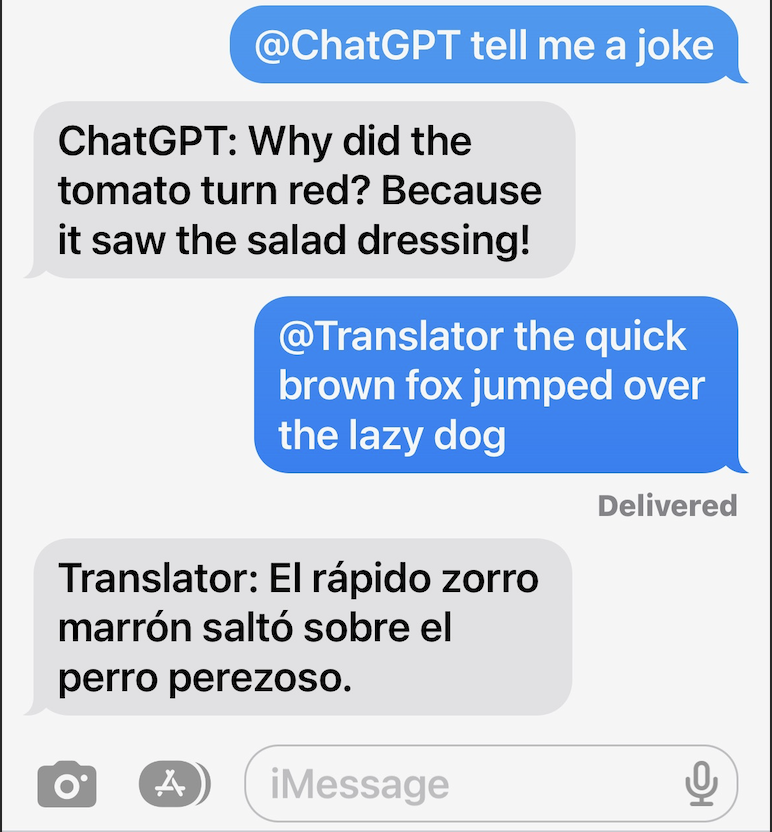

# iMessage-GPT

## Overview:
This project allows you to add multiple customizable AI chatbots into iMessage chats. Whenever one of the bots is tagged in a message, a response generated by ChatGPT is automatically sent in the chat. Here's an example of what that looks like with two AI models: the first being the standard ChatGPT and the second being a Spanish to English translator. 
<!--  -->


## Features
* Allows multiple customizable AI models with independent chat histories
* Works for both one-on-one chats and groupchats
* Able to specify which chats are monitored
* Models are able to know who is sending a request, allowing personalized responses

## Dependencies: 
* python-dotenv
* python-typedstream: https://github.com/dgelessus/python-typedstream

## Setup:
* Make sure you are running this from a Mac that has access to your iMessage
* Make sure whatever you're running the script on (VS code, terminal, etc) has full-disk access
* Install dependencies
* Create .env file using .env.template
* Edit the chat/config.json file to personalize your chatbots. (example below)
  * The chatIds field is a list of the IDs of the chats that will be monitored. Any chat not listed in this field will not have the ability to receive responses from the chatbots. The ID for a group chat looks something like "chat123456789123456789", and it can be found in your chat.db file under the "cache_roomname" attribute. The ID for a one-on-one chat is just the phone number (with the country code included) or the email of the other person. 
  * The contacts field is used to tell the chatbots which phone numbers correspond to which names. It is an object with the phone number as the key (with the country code included) and the name as the value. Use "ME" as the key for the name of the person running the script.
  * The models field is where you specify the names of the chatbots and how they should respond. The name can be whatever you want, it doesn't even need to have the @ symbol. Anytime a message contains this name, the chatbot will respond. The system field tells the bot how to respond. You can include what tone the bot should use, what its purpose is, background information it should know, how it should format its messages, etc. It's recommended that you include that the response should never contain the @ symbol, unless you want the bots to be able to invoke each other. 
```json
{
  "chatIds": ["chat123456789123456789", "+18005551234", "example@icloud.com"],
  "contacts": {
    "ME":"Logan",
    "+18005551234":"Mom",
    "+18005555678":"Dad"
  },
  "models": {
    "@ChatGPT": {
      "system":"Your name is ChatGPT. You are a personal assistant in a groupchat Format your message like this: ChatGPT: <message>. Messages directed at you will contain '@ChatGPT', but it is important that you (and only you) never use the @ symbol in your responses."
    },
    
    "@Translator": {
      "system":"You are an English-to-Spanish translator. You will be given a prompt in English, and your response will be that prompt translated into Spanish. Format your responses like this: Translator: <translated message>. Messages directed at you will contain '@Translator', but your response should not contain '@Translator' or any version of it."
    }
  }
}
```

## Usage:
* From the root directory, run using python3 src/main.py
* Send a message in the groupchat with one of the names specified in /chat/config.json
* Get an AI generated response. The message will be sent from the number of the person running the script.
* Chat history can be cleared by including '--c' in a message

## Future Work
* Some less technical way to create a config file
* Use iMessage reply feature so it's clear which message a bot is responding to (if Apple ever supports automating relpies)

